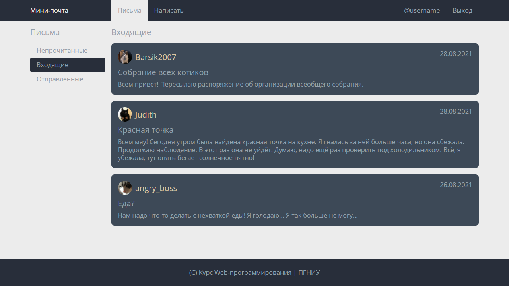

# Лабораторная работа №1: Вёрстка

> *Максимум 10 баллов. Часть Контрольной точки 2: HTML, CSS*

## Задача

Требуется реализовать вёрстку страницы по эскизу на основе заготовки в директории `solution`.

**Задачу требуется решить без использования дополнительных библиотек и систем сборки.**

#### Эскиз

#### Подсказки
- Используйте `flex`
- Установите `box-sizing: border` для всех элементов
- Вы можете использовать заготовку-сетку для отладки (включается добавлением модуля `grid.css` в файле `index.css`)

#### Критерии
- (3б) Страница в целом соответствует эскизу на HD (1280x720);
- (3б) Страница соответствует эскизу на HD (1280x720) с точностью более 99%;
- (2б) Страница соответствует эскизу на небольшом экране (1024x576) с точностью более 99%;
- (1б) Использованы семантические теги (`nav, main, footer, article, time`), отсутствует лишняя разметка,
использованы понятные имена классов, нет сложных селекторов, селекторов по ID;
- (1б) CSS разделён на модули, основные параметры заданы через CSS переменные

## Формальное описание для автоматического тестирования

Автоматическое тестирование проводится в браузере, основанном на Chromium (Electron), с использованием фреймворка [Cypress](https://www.cypress.io/).

### Сетка

##### 1280x720

##### 1024x576

### Основные параметры

- Межстрочный интервал: `1.25`
- Шрифт: `Arial, sans-serif`
- Размеры шрифта:
    - Основной: `16px`
    - Маленький (дата сообщения): `0.75rem`
    - Большой: `1.25rem`
    - Заголовочный: `1.5rem`
- Цвета:
    - Основной цвет текста: `#212529`
    - Серый (заголовки, рамки): `#6c757d`
    - Белый: `#ffffff`
    - Синий (ссылки, кнопки): `#3277de`
    - Красный (кнопки): `#ff4040`
    - Фон непрочитанного сообщения: `#e1e3fd`
    - Фон страницы: `#f8f9fa`
    - Фон навигационной панели: `#2a2a3a`
    - Фон белый: `#ffffff`
- Максимальный размер основной части сайта: `1124px`
- Отступы:
    - Базовый: `1rem`
    - Большой (вокруг подвала): `3rem`
    - Маленький: `0.5rem`
    - Очень маленький: `0.25rem`
- Радиус скругления рамок:
    - Основной (список сообщений): `0.5rem`
    - Маленький (кнопки): `0.25rem`
- Размер аватара: `2 rem`

### Описание компонентов

#### Страница

- Основное содержимое страницы находится внутри контейнера
- Размер контейнера ограничен максимальным значением
- На маленьком экране контейнер растягивается во всю ширину, оставляя базовые отступы до границ экрана
- Основная часть страница имеет светло-серый фон
- Внизу страницы подвал, имеющий большие вертикальные отступы
- Подвал прибит к нижней части страницы

#### Навигационная панель

- В верхней части сайта - навигационная панель
- Панель имеет базовые внутренние отступы по вертикали
- Содержимое находится внутри контейнера. Это логотип (белое название большим шрифтом, занимает одну колонку) и два меню (слева и справа)
- Элементы меню разделены базовым отступом
- Цвет текста ссылок в меню - серый
- Цвет активной ссылки - белый

#### Основная часть

- Основная часть отделена базовым отступом от навигационной панели
- Основная часть визуально делится на колонки шириной 1/6 и 5/6
- Колонки разделены базовым отступом
- В начале каждой колонки жирный заголовок серого цвета заголовочного размера шрифта с маленьким отступом снизу

#### Меню

- Меню - список ссылок
- Каждая ссылка имеет базовый внутренний отступ по горизонтали и маленький внутренний отступ по вертикали
- Активная ссылка имеет синий фон, белый текст и маленькое скругление рамки

#### Список сообщений

- Каждое сообщение имеет серую рамку в 1px и базовый внутренний отступ
- Рамки соседних сообщений не слипаются
- Первое и последние сообщения имеют скруглённые рамки
- Непрочитанное сообщение имеет особый цвет фона
- Контент сообщения разделён на две части: основную с текстом (занимает всё доступное место) и дополнительную справа
- Основная часть содержит три параграфа, разделённых очень маленьким отступом
- Первый параграф содержит аватар и имя отправителя жирным шрифтом большого размера
- Аватар - круглый блок, который отделяется от имени базовым отступом
- Изображение внутри блока с аватаром занимает всё доступное место, сохраняя исходные пропорции (используйте `background-size`)
- Тема сообщения выводится серым цветом шрифтом большого размера
- Справа выводится дата вверху и кнопки внизу
- Дата выводится серым цветом шрифтом маленького размера в элементе `<time>`
- Кнопки разделены маленьким отступом

#### Кнопки

- Кнопки имеют маленькое скругление рамки
- Кнопки имеют очень маленький внутренний отступ
- Основная кнопка имеет синий фон и белый текст
- Красная кнопка имеет красный фон и белый текст
- При наведении цвета фона и текста кнопки меняются местами, появляется рамка того же цвета

## Инструкция по автоматическому тестированию

*Примечание: первая установка может потребовать около 5 минут и ~50МБ интернет трафика.*

1. Установите [Node.js](https://nodejs.org/) версии не ниже 12 LTS
2. Установите зависимости, введя команду `npm install` в терминал в этой директории
3. Запустите тестирование, введя команду `npm test` (займёт около 30 секунд)
4. Если тестирование будет выполнено успешно, делайте коммит и отправляйте решение
5. Если тестирование провалится, в директории `snapshots/lab-1.spec.js/__diff_output__` будут изображение со сравнением вашего результата и ожидаемого

**Важно:** время тестирования ограничено. Пожалуйста, не отправляйте решение, пока не будете готовы его сдавать :)
